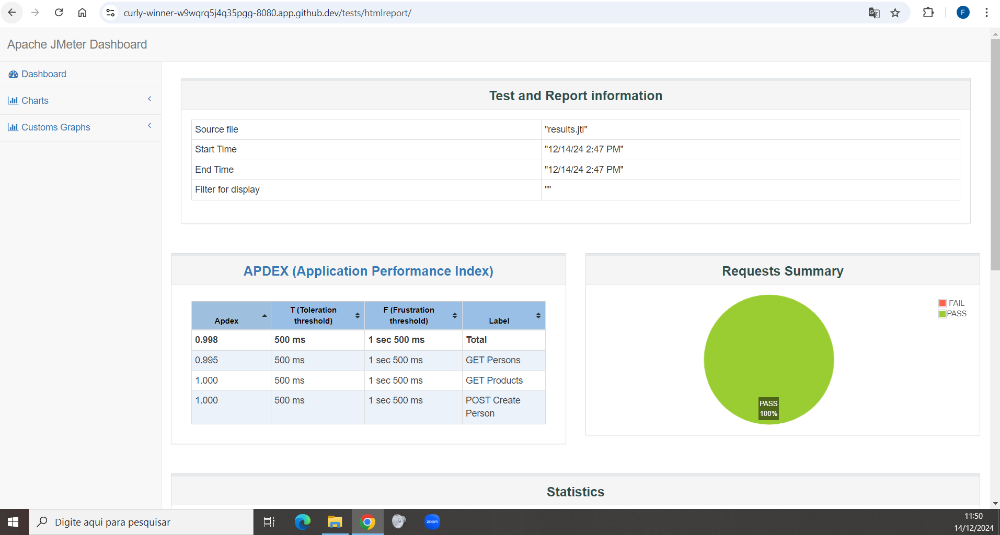
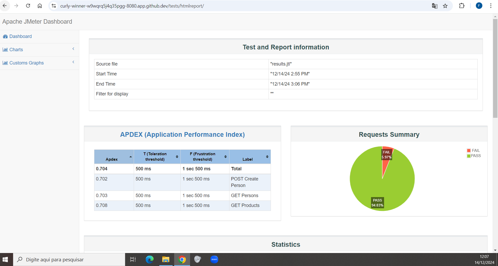

# jmeterdevops
Repo sobre monitoramento ativo

## Projeto Final monitoramento Ativo
### Alunos
### Fábio José dos Santos
### Jeremias Barbosa de Moura
### Marcos Librelon Raia

### Evidências do exercicio 1 - Projeto Final de Monitoramento Jmeter

